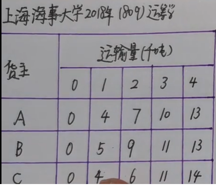
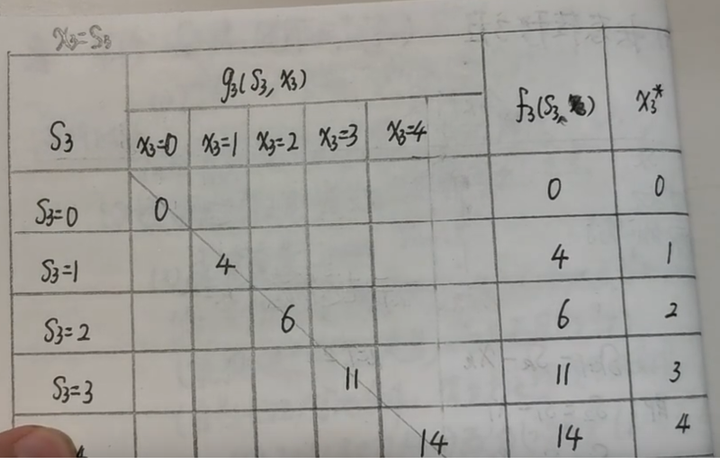
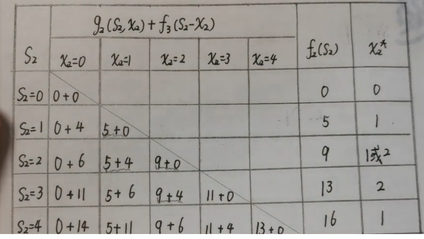
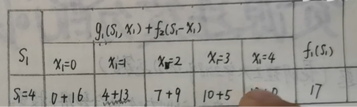
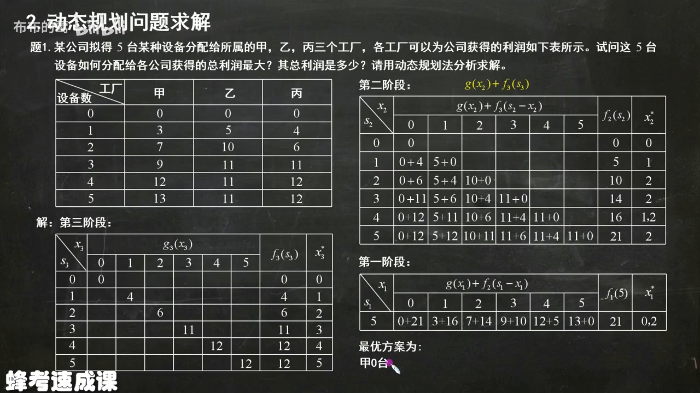

## 运输问题
1. https://www.bilibili.com/video/BV1Ri4y1u7em?p=4&spm_id_from=pageDriver&vd_source=f32f321bbed8634e6840f3c2b3b73a15





## 资源分配
2. https://www.bilibili.com/video/BV1d84y1R7jL/?vd_source=f32f321bbed8634e6840f3c2b3b73a15



表格包含了三种产品（工, 田, 工）和一个总原料数量为5的分配方案。表格中显示了每种原料分配情况下每个产品的收益。您的目标是分配这5单位原料以获得最大的总收益。

这个问题是一个经典的动态规划问题，通常称为“背包问题”的一种变体，其中每个“物品”（在这种情况下是原料单位）可以有不同的收益，取决于它被分配到的“项目”（产品）。我们需要计算在给定的原料限制下如何分配原料以最大化总收益。

### 动态规划解决方案

定义 `dp[i][j]` 为当有 `i` 单位原料且考虑到第 `j` 种产品时的最大收益。

```java
public class ResourceAllocation {

    public static int maxProfit(int totalResources, int[][] profits) {
        int numProducts = profits[0].length;
        int[] dp = new int[totalResources + 1];

        for (int product = 0; product < numProducts; product++) {
            for (int resource = totalResources; resource >= 0; resource--) {
                for (int used = 0; used <= resource; used++) {
                    dp[resource] = Math.max(dp[resource], dp[resource - used] + profits[used][product]);
                }
            }
        }

        return dp[totalResources];
    }

    public static void main(String[] args) {
        // 假设profits[i][j] 表示第j种产品使用i单位原料可以获得的收益
        // 表格对应的数组表示如下（产品顺序为：工, 田, 工）
        int[][] profits = {
            {0, 0, 0},  // 0单位原料
            {3, 5, 4},  // 1单位原料
            {7, 10, 6}, // 2单位原料
            {9, 11, 11},// 3单位原料
            {12, 11, 12},// 4单位原料
            {13, 11, 12} // 5单位原料
        };
        
        int totalResources = 5;
        System.out.println("Maximum profit: " + maxProfit(totalResources, profits));
    }
}
```

### 解释代码
1. **二维数组`profits`**: 定义了从0到5单位原料的每种产品可能的收益。
2. **循环**:
    - 外层循环`product`遍历每种产品。
    - 中间的循环`resource`遍历每个资源量。
    - 内层的循环`used`尝试所有可能的资源分配量。
3. **更新`dp`数组**:
    - 动态更新`dp[resource]`以存储到目前为止，给定资源和产品组合时可能的最大收益。

这个方法确保你可以动态地考虑每种产品的所有可能收益，并计算在总资源量限制下的最大可能总收益。


2. 设有某种原料 , 总数量为 a, 用于生产 n 种产品。若分配数量 xi用于生产第 i 种产品 , 其收益为 gi( xi)。问应如何分配 , 才能使生产 n 种产品的总收入最大 ? 
要解决这个问题，我们首先需要了解每种产品的收益函数 \( g_i(x_i) \)，这些函数描述了每种原料数量对应的收益。然后，问题可以通过动态规划或其他优化方法求解，寻找最优的原料分配策略以最大化总收入。

在没有具体的收益函数形式的情况下，我将给出一个一般性的动态规划解法的框架。这个解法假定收益函数是递增的，这意味着更多的原料投入会带来更多的收益，但通常会遇到递减的边际收益。

### 动态规划解法概念

假设 `dp[j]` 表示有 `j` 单位原料时能得到的最大收益。我们的目标是计算 `dp[a]`，即全部 `a` 单位原料的最大收益。

动态规划的状态转移方程可能是：
\[ dp[j] = \max(dp[j], dp[j - x] + g_i(x)) \]
其中 `x` 是分配给产品 `i` 的原料数量，而 `j - x` 必须非负。

我们需要对于每种产品和每种可能的原料分配情况，更新 `dp` 数组。

### Java实现框架

假设我们有具体的收益函数的实现，这里是一个解法的框架：

```java
public class ProductAllocation {
    // 模拟的收益函数实现，实际需要根据具体函数修改
    static double[] gi(int xi, int i) {
        // 示例：线性收益函数
        double[] coefficients = {1.0, 2.0, 3.0}; // 假设三种产品的收益系数
        return new double[] {xi * coefficients[i]};
    }

    // 动态规划求解最大收益
    static double maxProfit(int a, int n) {
        double[] dp = new double[a + 1];

        // 对于每种产品
        for (int i = 0; i < n; i++) {
            // 尝试所有可能的原料分配方式
            for (int j = a; j >= 0; j--) {
                // 分配 x 单位原料给产品 i
                for (int x = 0; x <= j; x++) {
                    dp[j] = Math.max(dp[j], dp[j - x] + gi(x, i)[0]);
                }
            }
        }

        return dp[a];
    }

    public static void main(String[] args) {
        int totalMaterials = 100; // 总原料
        int numProducts = 3; // 产品种类
        System.out.println("Maximum profit: " + maxProfit(totalMaterials, numProducts));
    }
}
```

### 注意
1. 上述代码仅是一个框架，具体实现需要根据具体的收益函数来调整。
2. 如果收益函数非常复杂或存在非传统形态，可能需要采用更高级的优化技术，如线性规划、非线性规划等。
3. 效率问题：这种方法可能在原料或产品种类较多时变得效率低下，可能需要额外的优化或使用近似方法。

