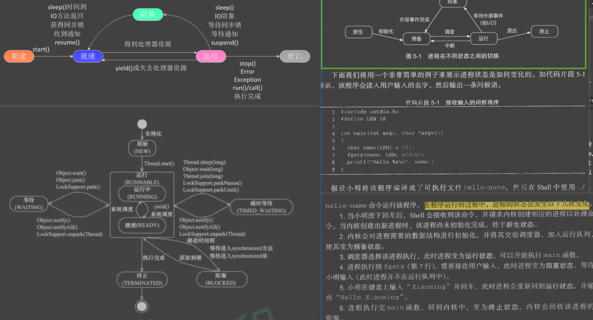

# course: https://ipads.se.sjtu.edu.cn/ospi/

- 20240427


- 20240423_Learning


- 20240422_Learning


# 20240427
### Java 程序启动流程

Java 程序启动流程关注的是 Java 虚拟机（JVM）的启动，类的加载，以及整个应用程序的执行。如前所述，这个过程包括以下步骤：

1. **运行 `java` 命令**：通过命令行启动 JVM。
2. **加载 JVM**：操作系统加载 JVM 以及配置初始化参数。
3. **类加载**：JVM 通过类加载器加载主类和其他依赖类。
4. **解析和初始化**：解析加载的类并初始化静态字段和执行静态代码块。
5. **执行主方法**：JVM 执行主类的 `main` 方法，开始程序的运行。
6. **程序执行**：应用程序根据 `main` 方法中的代码逻辑执行。
7. **程序终止和 JVM 退出**：程序运行完成后，JVM 清理资源并退出。

### 线程启动流程

线程启动流程则专注于 Java 中单个线程的创建和启动。它是 Java 程序中的一个更细粒度的操作，通常包括以下步骤：

1. **创建 Thread 实例**：通过新建一个 Thread 类的实例或其子类的实例，或者通过实现 Runnable 接口的类的实例。
2. **初始化线程对象**：设置线程的属性，如线程名、守护状态等。
3. **调用 start() 方法**：通过调用 Thread 实例的 `start()` 方法来启动线程。这个调用会通知 JVM 创建一个新的线程。
4. **JVM 调度线程**：JVM 调用操作系统的功能来创建一个新的轻量级进程或线程，并将线程的状态设置为可运行。
5. **执行 run() 方法**：线程开始运行其 `run()` 方法中的代码。
6. **线程终止**：当 `run()` 方法执行完成后，线程将结束生命周期。如果有异常未被捕获，线程也会提前终止。

### 主要区别

- **层次和范围**：Java 程序的启动流程是整个应用程序级别的，涉及到 JVM 的启动和管理，而线程启动流程是在已运行的 JVM 内部对单个线程的操作。
- **管理实体**：程序的启动由操作系统和 JVM 控制，涉及到进程的创建；线程的启动是由 JVM 控制，涉及到线程的创建和调度。
- **执行内容**：程序启动流程负责整个 Java 应用的运行，包括所有类的加载和 `main` 方法的执行；线程启动流程只关注单个线程的创建和其 `run()` 方法的执行。

## 线程挂起
在 Java 程序中，使用 `wait()` 方法确实涉及到了线程的挂起（suspension）。当线程调用 `wait()` 方法时，它会被挂起，直到某些特定条件被满足（例如其他线程调用同一个对象的 `notify()` 或 `notifyAll()` 方法）。这里的挂起并非是操作系统层面的线程挂起，而是 Java 虚拟机内部的状态管理。

### 线程挂起的过程解析：

1. **释放锁**：
   - 在调用 `wait()` 方法前，线程必须持有该对象的锁。调用 `wait()` 时，线程会释放该对象的锁，这使得其他线程可以获取该对象的锁来执行其他同步代码块。

2. **进入等待状态**：
   - 线程释放锁后，它会进入等待状态。在 Java 中，这通常意味着线程被放置在该对象的等待池（wait set）中。这是一个线程等待队列，线程会在这个队列中等待直到接收到通知或被中断。

3. **上下文切换**：
   - 当线程调用 `wait()` 并释放锁后，Java 虚拟机会通知操作系统该线程现在不需要 CPU 资源，操作系统随后进行上下文切换，将 CPU 分配给其他可运行的线程。

4. **被唤醒**：
   - 当其他线程调用同一对象的 `notify()` 或 `notifyAll()` 方法时，等待中的一个或所有线程将被唤醒。被唤醒的线程将尝试重新获取之前释放的锁；只有在获取到锁之后，线程才能继续执行。

### 关键点：

- **挂起与阻塞**：线程的挂起不同于阻塞，阻塞通常发生在等待 I/O 操作完成或尝试获取已被其他线程持有的锁时。挂起是指线程主动释放锁，并等待某个条件的发生（如 `notify()`）。
- **资源管理**：挂起线程不消耗 CPU 资源，因为它们不进行任何计算。这有助于系统资源管理，避免无谓的计算资源浪费。

通过这种机制，Java 程序可以有效地管理线程间的协作与资源共享，同时确保线程操作的安全性和有效性。

### 如何实现上下文切换？
在 Java 程序中，特别是使用多线程时，确实涉及到了上下文切换（context switching）。上下文切换是操作系统在多任务和多线程环境中管理进程或线程的一种机制。在多线程程序如 `AlternatePrinter` 中，当不同的线程（如 `t1` 和 `t2`）交替执行时，操作系统需要在它们之间进行切换。

在你提到的 Java 程序中，`t1` 和 `t2` 通过 `synchronized` 关键字和 `wait()` 及 `notify()` 方法进行同步。当一个线程如 `t1` 调用 `wait()` 方法时，它会释放当前持有的锁（在这个场景中是 `lock` 对象）并进入等待状态。这时，操作系统将 `t1` 线程置于等待队列中，并进行上下文切换，把 CPU 控制权转移给另一个线程，即 `t2`。当 `t2` 在其执行过程中到达相应的 `notify()` 调用时，它会通知操作系统 `t1` 可以继续执行。此时如果 `t2` 也调用了 `wait()`，则同样释放锁并等待，操作系统需要再次进行上下文切换，恢复 `t1` 的执行状态。

### 上下文切换的实现细节：

1. **保存和恢复状态**：操作系统在进行上下文切换时，会保存当前线程的状态（如 CPU 寄存器状态、程序计数器等），然后加载另一个线程的状态。这样，每个线程都可以从上次暂停的地方继续执行。

2. **线程调度**：操作系统的调度器决定哪个线程获得 CPU 执行权。在 Java 中，JVM 内部模型将 Java 线程映射到操作系统原生线程上，由操作系统的线程调度器管理。

3. **同步机制**：在 Java 中，`synchronized`，`wait()` 和 `notify()` 为线程提供了一种同步机制，以确保在并发环境下数据的一致性和线程的有序执行。

### 总结

在涉及到多线程交互和资源共享的程序中，上下文切换是不可避免的。它允许操作系统有效地管理多个线程，使得即使在单核 CPU 上也能实现多任务并发执行。虽然上下文切换有助于资源管理和线程间的公平调度，但也会引入一定的性能开销。因此，合理设计线程同步和交互逻辑，以减少不必要的上下文切换，是提高多线程程序效率的关键。

## 等待队列
在 Java 中，对象的等待队列（wait set）是虚拟机内部的一个抽象结构，用来存放调用了该对象的 `wait()` 方法并进入等待状态的线程。这个队列是 JVM 管理的，并不直接暴露给 Java 程序员。等待队列确保所有等待线程有序地等待 `notify()` 或 `notifyAll()` 调用以重新进入对象的锁竞争。

JVM 的等待队列通常是由链表或其他队列数据结构实现的，包含了所有处于等待状态的线程引用。这些线程都是因为调用了某个对象的 `wait()` 方法而被挂起，直到它们被 `notify()` 或 `notifyAll()` 唤醒。每个对象都有自己的监视器（Monitor），监视器中包含两个基本队列：
- **Entry Set**：想要获取对象锁但尚未成功的线程集合。
- **Wait Set**：调用了对象的 `wait()` 方法并释放了锁的线程集合。

### Java 示例展示

虽然我们不能直接访问或修改 JVM 中的等待队列，但可以通过简单的 Java 代码示例演示线程如何使用这些队列。以下是一个示例，演示了如何使用 `wait()` 和 `notify()` 方法：

```java
public class WaitNotifyExample {
    private static final Object lock = new Object();

    static class WaitingThread implements Runnable {
        public void run() {
            synchronized (lock) {
                try {
                    System.out.println(Thread.currentThread().getName() + " is going to wait.");
                    lock.wait();  // 线程进入等待队列，释放锁
                    System.out.println(Thread.currentThread().getName() + " has been notified.");
                } catch (InterruptedException e) {
                    Thread.currentThread().interrupt();
                }
            }
        }
    }

    static class NotifyingThread implements Runnable {
        public void run() {
            synchronized (lock) {
                try {
                    Thread.sleep(1000);  // 确保等待线程已经进入等待状态
                } catch (InterruptedException e) {
                    Thread.currentThread().interrupt();
                }
                lock.notify();  // 唤醒一个等待线程
                System.out.println("Notified one thread.");
            }
        }
    }

    public static void main(String[] args) {
        Thread t1 = new Thread(new WaitingThread(), "Thread-1");
        Thread t2 = new Thread(new WaitingThread(), "Thread-2");
        Thread notifier = new Thread(new NotifyingThread(), "Notifier");

        t1.start();
        t2.start();
        notifier.start();
    }
}
```

在这个例子中：
- `WaitingThread` 线程运行时进入 synchronized 块，并调用 `wait()` 方法。这使得它释放 `lock` 对象的锁并进入该对象的等待队列。
- `NotifyingThread` 线程在等待一段时间后调用 `notify()`，这会从 `lock` 对象的等待队列中随机唤醒一个线程。

这个程序演示了如何通过 Java 的同步机制来模拟线程的等待和通知过程，虽然我们无法直观看到等待队列的内部结构，但可以通过这种方式理解和掌握其使用方法。

## JVM and Thread Management
In the Java Virtual Machine (JVM), the management of thread states such as waiting, running, and runnable is handled by both the JVM and the underlying operating system. Here's how it typically works:

### JVM and Thread Management

1. **Thread States in JVM**:
   - The JVM recognizes several thread states, including:
     - **New**: The thread has been created but not yet started.
     - **Runnable**: The thread is ready to run and just waiting for CPU time.
     - **Blocked**: The thread is blocked waiting for a monitor lock.
     - **Waiting**: The thread is waiting indefinitely for another thread to perform a specific action (like notification or releasing a lock).
     - **Timed Waiting**: Similar to waiting, but the thread waits for a specified amount of time.
     - **Terminated**: The thread has completed its execution.

2. **JVM's Thread Scheduling**:
   - While the JVM manages thread states and transitions, the actual scheduling of threads to CPU cores is handled by the operating system's scheduler. The JVM interacts with the operating system to manage these threads.

3. **Where Threads Wait and Run**:
   - **Running and Runnable Threads**: These are managed within the JVM but scheduled by the operating system. When a thread is in the `Runnable` state, it means it is ready to run, and as soon as the OS scheduler assigns it CPU time, it moves to the `Running` state.
   - **Waiting and Blocked Threads**: When threads enter the `wait()` state, they do so within a context managed by the JVM. The JVM maintains a wait set for each object, which is a set of threads that are waiting for an object (for example, through `object.wait()`). The threads remain in this wait set until they are notified (`object.notify()`) or interrupted.
     - The blocked state occurs when a thread tries to acquire an object's lock (entrance into a `synchronized` block) but another thread holds the lock. The JVM puts the thread in a blocked state until the lock becomes available.

4. **Memory Management for Threads**:
   - Each thread has its own stack, managed by the JVM. This stack contains method calls, return addresses, and local variables. The heap, where the objects are allocated, is shared among all threads.
   - Synchronization (as in `synchronized` blocks or methods) ensures that changes in the shared memory (heap) made by one thread are visible to other threads. This involves memory barriers and can require flushing caches and registers to main memory.

### How Threads Communicate in JVM

- **`wait()`, `notify()`, and `notifyAll()`**:
  - These methods are used for inter-thread communication. When a thread calls `wait()` on an object, it releases the lock on that object and enters the waiting state. The thread remains in this state until either another thread calls `notify()` or `notifyAll()` on the same object.
  - `notify()` wakes up a single waiting thread, whereas `notifyAll()` wakes up all waiting threads associated with the object. The threads that are woken will then compete for the object's lock.

Overall, the JVM provides a high-level management framework for threading, including state management and synchronization, while relying on the operating system to handle the low-level details of thread scheduling and execution on the CPU.

## CPU structure
The structure of a Central Processing Unit (CPU) is designed to handle the computation tasks of a computer. It is composed of several key components that work together to process instructions, perform calculations, and manage data flow. Here's a breakdown of the main components of a typical CPU:

### 1. **Core Components**
- **Cores**: Modern CPUs can have multiple cores, with each core capable of processing tasks independently. This allows for multi-threading, where different cores handle different threads of execution simultaneously, improving overall performance.
- **ALU (Arithmetic Logic Unit)**: The ALU is where the CPU performs arithmetic and logical operations. It is a critical part of the processor, handling all mathematical calculations and logical comparisons.
- **CU (Control Unit)**: The control unit manages the CPU's operations. It reads instruction codes from memory, interprets them, and sends signals to other parts of the CPU to execute these instructions.
- **Registers**: Registers are small, fast storage locations within the CPU used to hold data that needs to be accessed quickly, such as the currently executing instructions, or immediate data needed by the operations.

### 2. **Cache Memory**
- **L1, L2, and L3 Caches**: CPUs include several layers of cache memory to store frequently accessed data and instructions close to the processor. L1 cache is the smallest and fastest, typically built into the processor chip itself. L2 and L3 caches are larger and slightly slower but still faster than accessing main RAM. These caches reduce the time the CPU spends waiting for data from the main memory.

### 3. **Clock**
- **Clock Rate**: The clock controls the timing of all CPU operations. The CPU's speed is often measured by its clock rate in gigahertz (GHz), which indicates the number of cycles it can perform in a second.

### 4. **Bus Interface**
- **Front Side Bus (FSB)**: The FSB connects the CPU to the main memory (RAM) and other motherboard components. It determines the speed at which data travels between the CPU and the RAM, thus impacting the overall system performance.

### 5. **Floating Point Unit (FPU)**
- **FPU**: Also known as a math coprocessor, the FPU is specialized for handling complex mathematical operations, particularly those involving floating-point numbers. It is crucial for applications that require high precision and mathematical calculations, such as scientific computations and graphics processing.

### 6. **Pipelines**
- **Instruction Pipeline**: Modern CPUs use pipelining to improve performance. Pipelining allows a CPU to process multiple instructions simultaneously by breaking down the execution pathway into discrete stages. This enables the CPU to work on several instructions at once, each at a different stage of its execution.

### 7. **Branch Predictor**
- **Branch Predictor**: This is a system within the CPU that tries to guess which way a branch (like an if-then-else structure) will go before this is known definitively. This improves efficiency by allowing the CPU to prepare for the next instructions to execute before the branch decision is fully computed.

### Architecture Types
- **Von Neumann Architecture**: Uses the same memory and bus to store both data and instructions.
- **Harvard Architecture**: Uses separate memories and buses for data and instructions, allowing the CPU to access data and instructions simultaneously and therefore operate more quickly.

## The relationship between a Java program and the CPU
The relationship between a Java program and the CPU, as well as the process for running a Java program, involves several stages of interaction across different system components. Here’s a detailed breakdown:

### Relationship Between CPU and Java Program

1. **Abstraction Layer Provided by JVM**:
   - The Java Virtual Machine (JVM) acts as an intermediary layer between a Java program and the CPU. This abstraction allows Java programs to run on any device with a JVM, making Java applications platform-independent. The JVM translates Java bytecode, which is platform-independent, into native machine instructions that the CPU can execute.

2. **Just-In-Time Compilation (JIT)**:
   - Modern JVMs improve performance through Just-In-Time (JIT) compilation, where Java bytecode is compiled into native code at runtime. This step optimizes the performance by allowing the CPU to execute native code instead of interpreting bytecode. This means the CPU interacts with more efficient, directly executable code.

3. **CPU Scheduling**:
   - The CPU schedules threads managed by the JVM. Although Java threads are managed at the JVM level, they are mapped onto native operating system threads. The OS, with its scheduler, then manages these threads on the CPU, determining which threads run and for how long.

### Process for Running a Java Program

1. **Writing the Code**:
   - The first step involves writing the Java source code in `.java` files. This code is typically written in an Integrated Development Environment (IDE) or a simple text editor.

2. **Compiling the Code**:
   - The Java source code is compiled by the Java compiler (`javac`) into bytecode. This bytecode is stored in `.class` files, which are platform-independent. This compilation step does not involve the CPU directly, as it’s handled at the software level by the Java compiler.

3. **Loading the Class Files**:
   - When a Java program is run, the JVM loads the `.class` files containing the bytecode. The class loader component of the JVM is responsible for this task. It reads the bytecode and brings it into the runtime environment.

4. **Running the Program**:
   - The Execution Engine of the JVM takes the loaded bytecode and executes it. Initially, the bytecode is interpreted line-by-line, which allows for platform independence but can be slower than native execution.
   - As the program runs, the JIT compiler may compile frequently executed code segments ("hot spots") into native machine code, significantly improving performance. This native code is directly executed by the CPU.

5. **Garbage Collection**:
   - During execution, the JVM manages memory allocation and deallocation using a garbage collector, which automatically frees memory that is no longer in use, helping to prevent memory leaks and overuse of memory.

6. **Interaction with Operating System**:
   - Throughout its execution, the JVM interacts with the operating system for resources like memory, processing time, and input/output operations. These interactions are crucial as they allow the Java program to utilize underlying hardware effectively.

### Conclusion

The CPU does not directly execute the Java code. Instead, it executes the native code generated by the JVM’s JIT compiler from Java bytecode. This process ensures that Java programs are portable across different platforms but still can be executed efficiently on any given hardware. The JVM acts as a crucial bridge, handling the details of code translation, memory management, and system integration, abstracting these complexities from the Java developer.

